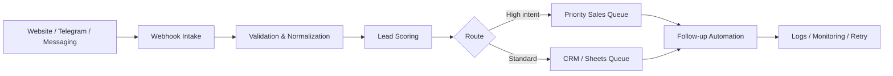

# AI Automation Portfolio

Production-minded automation examples by **Sameer Ahmad / Freshtiq Innovations**.

This repository demonstrates the engineering patterns I use for AI and business automation: lead intake, API/webhook integrations, Telegram-style bot workflows, retry/recovery logic, logging, and deployment readiness.

> Portfolio/demo repository. Customer data, production credentials, private endpoints, and proprietary business logic are intentionally excluded.

## What this demonstrates

- **AI & business automation** — structured lead intake, qualification, routing, and follow-up state
- **API / webhook integration** — clean HTTP boundaries and typed payloads
- **Telegram bot architecture** — adapter-friendly message handling without hard-coding credentials
- **Python automation** — deterministic logic, validation, logging, and tests
- **Reliability** — bounded retries, backoff, health checks, idempotent processing
- **Deployment mindset** — environment-based configuration and CI tests

## Architecture



## Demo projects

### 1. Lead Intake & Qualification
`src/lead_router.py` normalizes inbound leads, calculates a transparent intent score, and routes them without hiding logic inside a black box.

### 2. Resilient Automation Worker
`src/resilient_worker.py` demonstrates bounded retry with exponential backoff, idempotency keys, and explicit failure handling.

### 3. Webhook API
`src/webhook_app.py` exposes health and lead-intake endpoints using FastAPI.

## Run locally

```bash
python -m venv .venv
source .venv/bin/activate
pip install -r requirements.txt
uvicorn src.webhook_app:app --reload
```

Then:

```bash
curl http://127.0.0.1:8000/health
curl -X POST http://127.0.0.1:8000/lead \
  -H "content-type: application/json" \
  -d @examples/sample_lead.json
```

## Test

```bash
pytest -q
```

## Typical client use cases

- Telegram business bots and AI assistants
- Lead capture and qualification
- CRM / Google Sheets / email workflow automation
- REST API and webhook integrations
- VPS-hosted Python automations
- Monitoring, retries, and recovery for long-running agents

## Engineering principles

1. **Human-readable automation** — clear logic and traceable decisions
2. **Fail safely** — retries are bounded and errors are explicit
3. **No secrets in code** — configuration belongs in environment variables
4. **Verify outcomes** — automated tests and health endpoints
5. **Design for handoff** — code and docs should be maintainable by the client

## About

I build AI automation systems, Telegram bots, API integrations, and resilient workflow infrastructure through **Freshtiq Innovations OPC Private Limited**.

Website: https://www.freshtiqautomation.com
